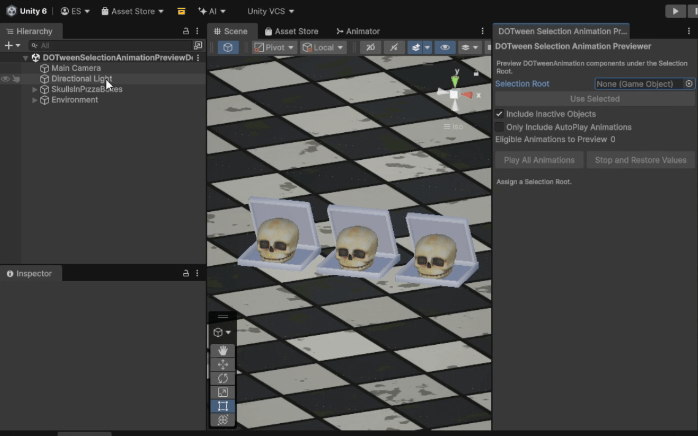
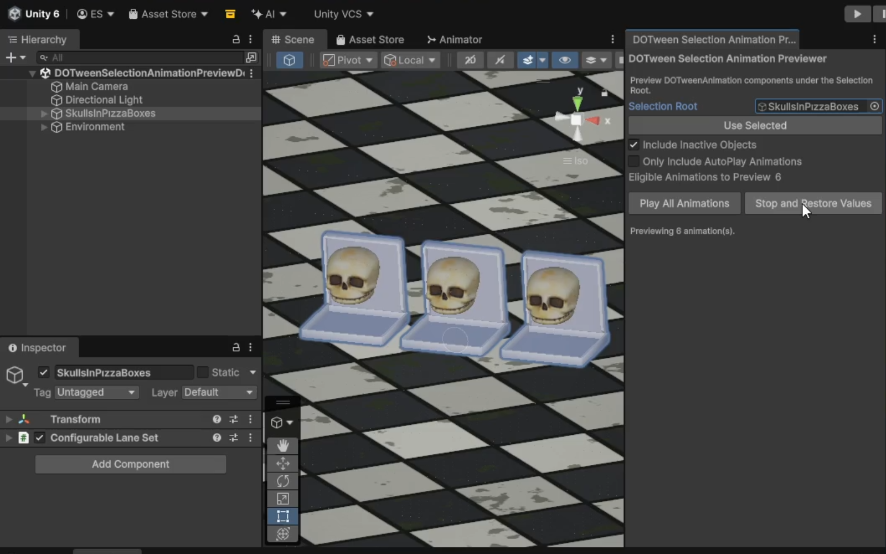

# DOTween Selection Animation Previewer

DOTween Selection Animation Previewer previews multiple eligible DOTween animations together under a selected hierarchy root. It helps developers inspect how animations interact in scenes or Prefab Mode without entering Play Mode.

The `Selection Root` can be a normal Scene GameObject or a GameObject inside Prefab Mode. The tool searches that root and its descendants so configured DOTween animations can be checked directly in the Editor.



## Key Features

- Editable `Selection Root` field.
- `Use Selected` shortcut for assigning the active Unity selection.
- Searches the `Selection Root` and descendants.
- Supports normal Scene GameObjects.
- Supports GameObjects inside Prefab Mode.
- Optional `Include Inactive Objects` search.
- Optional `Only Include AutoPlay Animations` filter.
- Editor preview without entering Play Mode.
- Previews multiple eligible `DOTweenAnimation` components together.
- `Stop and Restore Values` control for ending preview.
- Compile-safe fallback when DOTween Pro/editor preview APIs are unavailable.

## Requirements

- Unity Editor is required.
- Validated Unity version: `6000.3.15f1`.
- DOTween Pro is required for preview functionality.
- Tested DOTween version: `1.2.632`.
- Exact DOTween Pro version was not independently established.
- DOTween and DOTween Pro must be installed separately by the user.
- This repository does not include or redistribute DOTween, DOTween Pro, Demigiant, or DemiLib files.

Dependency behavior:

- Without DOTween, the tool remains compile-safe and opens with dependency guidance.
- With DOTween core but without the required DOTween Pro/editor preview APIs, the tool remains compile-safe, but preview functionality is unavailable.
- With the required DOTween Pro/editor preview APIs available, the full preview UI is enabled.

DOTween core alone is not sufficient for preview functionality.

## Installation

1. Install and set up DOTween and DOTween Pro through your own DOTween Pro installation.
2. Copy `Editor/DOTweenSelectionAnimationPreviewerWindow.cs` into an `Editor` folder in your Unity project, for example:

```text
Assets/Editor/DOTweenSelectionAnimationPreviewerWindow.cs
```

3. Let Unity compile.
4. Open `Tools/DOTween/Selection Animation Previewer`.

Do not copy third-party DOTween, DOTween Pro, Demigiant, or DemiLib files from this repository. They are not included here.

## Usage

1. Open `Tools/DOTween/Selection Animation Previewer`.
2. Assign a Scene or Prefab Mode GameObject to `Selection Root`, or select one and click `Use Selected`.
3. Configure `Include Inactive Objects` and `Only Include AutoPlay Animations` if needed.
4. Check `Eligible Animations to Preview`.
5. Click `Play All Animations`.
6. Click `Stop and Restore Values` when finished.

Changing the `Selection Root` stops and restores the current preview before switching targets.



## Controls

- `Selection Root`: Scene or Prefab Mode GameObject whose child `DOTweenAnimation` components will be previewed. Project prefab assets must be opened in Prefab Mode first.
- `Use Selected`: assigns the active selected GameObject as the `Selection Root`.
- `Include Inactive Objects`: includes `DOTweenAnimation` components on inactive child GameObjects.
- `Only Include AutoPlay Animations`: previews only `DOTweenAnimation` components with AutoPlay enabled.
- `Eligible Animations to Preview`: shows the number of currently eligible animations under the root.
- `Play All Animations`: starts editor preview for all eligible animations.
- `Stop and Restore Values`: stops preview and restores animated values.

## How Preview Works

The tool searches the `Selection Root` and descendants for `DOTweenAnimation` components, filters eligible components, and uses DOTween Pro's editor-preview functionality to preview configured animations in the Editor.

A `DOTweenAnimation` component is eligible when:

- the component exists
- `isActive == true`
- animation type is not `None`
- when AutoPlay filtering is enabled, `autoPlay == true`

When preview is stopped, active preview tweens are restored and killed, then DOTween editor preview is stopped.

Tested restore cases included ordinary movement, scale, delayed tweens, finite loops, `isFrom`, and multiple simultaneous animations. This does not guarantee perfect restoration for every possible DOTween configuration.

## Limitations

- Only `DOTweenAnimation` components under `Selection Root` and its descendants are considered.
- Arbitrary runtime-created tweens are outside this tool's scope.
- Project-window prefab assets cannot be previewed directly.
- To preview a prefab, open it in Prefab Mode and target a GameObject there.
- Normal Scene GameObjects are supported.
- Preview is unavailable while entering or running Play Mode.
- DOTween Pro/editor preview APIs are required for actual preview functionality.
- The tool does not explicitly mark previewed `DOTweenAnimation` components dirty.
- Validation observed that the tested completion callback did not fire during prepared editor-preview completion or stop/restore. Treat callback behavior as editor-preview-specific and verify your own callback setup if it matters.
- Validation found restored values and unchanged serialized Scene/prefab content in the tested cases. This is not a universal guarantee that every Editor context can never become dirty.

## Compatibility

Validated with:

- Unity `6000.3.15f1`
- DOTween `1.2.632`
- DOTween Pro required; exact tested Pro version was not independently discoverable
- no-DOTween, DOTween-core-only, and DOTween-Pro environments

Broader Unity or DOTween version compatibility has not been claimed.

## 7 Tools in 7 Days — Day 6

This tool is part of the **7 Tools in 7 Days** series.

[Read the Day 6 development story on Substack](https://ecesefercioglu.substack.com/p/7-tools-in-7-days-day-6-dotween-selection)

| Day | Tool |
| --- | --- |
| Day 1 | [Parent From Bounds](https://github.com/seferciogluecce/parent-from-bounds) |
| Day 2 | [Separate Mesh Bodies](https://github.com/seferciogluecce/separate-mesh-bodies) |
| Day 3 | [Brick Wall Generator](https://github.com/seferciogluecce/brick-wall-generator) |
| Day 4 | [Particle System Context Previewer](https://github.com/seferciogluecce/particle-system-context-previewer) |
| Day 5 | [Object Layout Tool](https://github.com/seferciogluecce/object-layout-tool) |
| **Day 6** | **[DOTween Selection Animation Previewer](https://github.com/seferciogluecce/dotween-selection-animation-previewer)** |
| Day 7 | [Wave Object Distributor](https://github.com/seferciogluecce/wave-object-distributor) |

## License

This project is available under the MIT License. See [LICENSE](LICENSE).

DOTween and DOTween Pro are separate third-party tools by Demigiant and are not included in this repository. This repository's MIT license does not apply to DOTween or DOTween Pro.